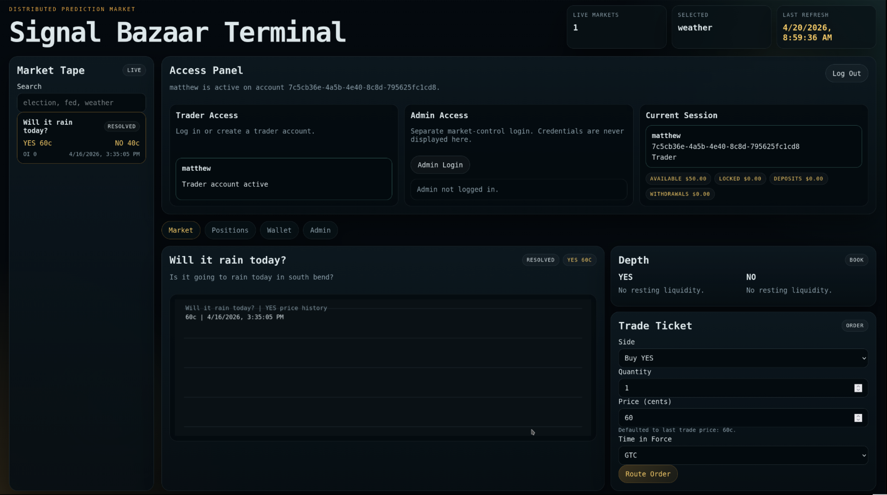

# Signal Bazaar: Distributed Prediction Market

**Team 3 members: Matthew Daly, Swindar Zhou, Mariam Jafri**

This repository implements a distributed prediction market: authenticated clients talk to listener nodes over TCP JSON-line RPC, matchmaker workers cross YES/NO orders and persist trades, and executor workers settle resolved markets against Aurora DSQL. A browser **Signal Bazaar Terminal** frontend (market tape, depth, trade ticket, wallet, and admin flows) sits in front of the listener for demos and operations.



## Goal

- **Listeners** ingest authenticated client RPC requests and write to Aurora DSQL.
- **Matchmakers** find executable crosses and write trades and position effects.
- **Executors** settle resolved markets.
- **Frontend** (`frontend/`) provides account login, market discovery, charts, order entry, and admin-only market lifecycle controls via the same listener APIs.

## Authoritative schema

- Single source of truth: `tables-create-dsql.sql`
- Aurora DSQL-compatible (no foreign keys, `CREATE INDEX ASYNC`, `IF NOT EXISTS`)

## Services and layout

| Component | Path | Role |
|-----------|------|------|
| Client listener | `client/client-listener/` | TCP JSON-line RPC server |
| Matchmaker | `matchmaker/` | Distributed matching worker |
| Executor | `executor/` | Distributed settlement worker |
| Frontend | `frontend/` | HTTP UI for traders and admins |
| Order utility | `client/order_client.py` | Basic CLI submitter |

Per-component run notes: `client/README.md`, `client/client-listener/README.md`, `matchmaker/README.md`, `executor/README.md`, `frontend/README.md`.

## Client listener RPCs

Supported actions:

- `ping`, `health`, `ready`
- `submit_order`, `cancel_order`, `get_order`, `list_orders`, `list_open_orders`, `cancel_all_orders`, `replace_order` (atomic cancel + submit)
- `get_trades`, `get_positions`, `get_account_balances`
- `deposit_cash`, `withdraw_cash`
- `create_market`, `update_market_status`, `resolve_market`, `get_order_book`

## Transactionality

Write paths use database transactions with OCC retry where appropriate:

- Submit, cancel, replace, cancel-all
- Deposit and withdraw
- Market status updates and resolution

## Tests

### `test/system_test.py`

End-to-end concurrency test with multiple listeners, matchmakers, and executors. Validates ingest and matching, partial fills, cancel behavior and idempotency, settlement and payouts, and cleanup of generated rows.

### `test/rpc_features_test.py`

RPC surface coverage for query APIs (`get_order`, `list_orders`, `get_trades`, `get_positions`, `get_order_book`, balances) and write APIs (`cancel_all_orders`, `replace_order`, `deposit_cash`, `withdraw_cash`, `create_market`, `update_market_status`, `resolve_market`).

### EC2 one-command runner

```bash
./test/run_system_test_ec2.sh
```

Bootstraps `.venv-test`, installs dependencies, generates Aurora DSQL IAM auth token and DSN, then runs `system_test.py` and `rpc_features_test.py`. Expect `SYSTEM TEST PASSED` and `RPC FEATURES TEST PASSED`.

Additional benchmarks and smoke tests live under `test/` (see filenames for submit scaling, fill latency, light RPC, auth, and frontend smoke).

## Frontend (terminal UI)

The SPA is served by `frontend/server.py` (static assets under `frontend/static/`). It covers account signup and login (session cookie), market tape and prices, trade history charting, order book depth, order routing, wallet balances, and admin login for market creation, status changes, and resolution.

Environment variables, default ports, session settings, and optional admin bootstrap are documented in `frontend/README.md`.

Typical local run (after listener is up and token is set):

```bash
export FRONTEND_LISTENER_HOST=127.0.0.1
export FRONTEND_LISTENER_PORT=9001
export FRONTEND_LISTENER_AUTH_TOKEN='<shared-token>'
python3 frontend/server.py
```

Then open `http://<host>:8080/` (default `FRONTEND_PORT` is 8080).

## Deployment and operations

- **EC2 / NLB / multi-listener topology:** `deploy/DEPLOY.md`
- **Schema apply:** `deploy/apply_schema.sh` (see runbook for `DSQL_HOST` and region)
- **Example env template:** `deploy/prediction-market.env.example`
- **Supervisor-style start (paths assume `/home/ubuntu/Distributed-Prediction-Market-Server`):** `start_services.sh`

## Operational notes

- Keep schema evolution in `tables-create-dsql.sql` only; do not introduce parallel schema definitions.
